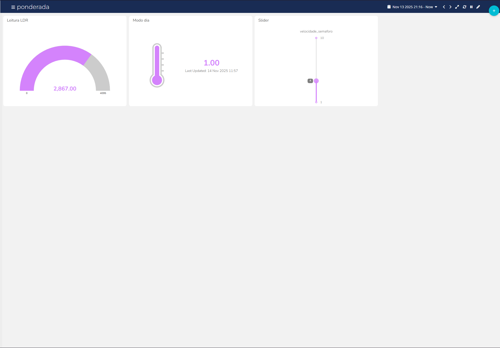

# Ponderada Semáforo Inteligente G04
 
## Integrantes:
 
Antônio André

Breno Silva

Diego Silva

Henrique Diniz

Messias Olivindo

Reimar Filho

Yuri Boczar

### Entrega:

O projeto consiste na montagem de dois semáforos controlados por um ESP32, junto com um sensor (LDR) e conexão MQTT, que juntos, conseguem criar um ecossistema de sinalização veícular inteligente que consegue identificar se é dia ou noite e passar essa informação para o sinal que muda o seu comportamento conforme o que é esperado. Sendo que, quando está noite, o sinal pisca amarelo, e quando dia pisca normalmente, para isso acontecer é utilizada uma conexão entre dois ESP32 e Ubidots.

- No Ubidots, é possível ver se o estado atual é dia ou noite, os valores do LDR e alterar a velocidade com que os semáforos executam suas ações.

**Como o LDR está integrado ao sistema:**

O LDR está ligado no pino analógico 34 do ESP32. Este resistor detecta a intensidade de luz do ambiente; em condições mais claras, a resistência aumenta; em ambientes mais escuros, a resistência diminui.

- Ciclo diurno: Valores acima de 1000 na leitura do resistor (verde–amarelo–vermelho alternando entre os dois sinaleiros).

- Ciclo noturno: Valores abaixo de 1000 na leitura do resistor (amarelo piscando nos dois sinaleiros).

**Como os dois ESP32 se comunicam no sistema:**

Por meio do Ubidots, que haje como uma ponte na troca de informações, o ESP32 "1" é responsável pela leitura do sensor LDR, que coleta o valor e envia esses dados para o Ubidots. O ESP32 "2", que controla os semáforos, acessa o Ubidots para obter os valores enviados, e, com base nessa captação, decide como o semáforo deve operar, além disso, com o Ubidots, é possível controlar a velocidade dos semáforos.

**Interface Ubidots:**

**LINK YOUTUBE**
https://www.youtube.com/watch?v=AOWGoT1VtBk
